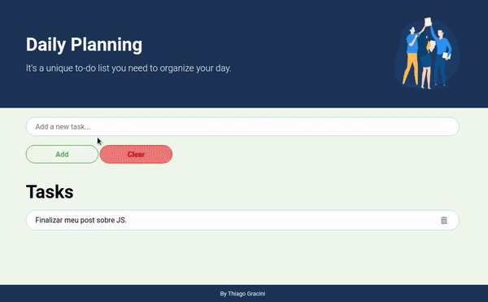

<h1 align="center">Daily Planning</h1>

This is a simple to-do list, a very useful tool to organize my tasks

 

 <a href="#objective">Objective</a> •
 <a href="#features">Features</a> • 
 <a href="#technologies">Technologies</a> •
 <a href="#author">Author</a>

 

<h1 align="center">
  
</h1>

 

<h3 id="objective">Objective</h2>

The main objective of this project is to fix my acquires knowledges how a developer

 

<h3 id="features">✅ Features</h3>

- [x] Add new tasks.
- [x] Button clear to erase input field.
- [x] Delete concluded tasks.

 

<h3 id="technologies">🛠 Technologies</h3>

The following technologies were used to build this project:

- [HTML](https://html.spec.whatwg.org/multipage/)
- [CSS](https://www.w3schools.com/css/)
- [JavaScript](https://www.javascript.com/)

 

<h3 id="author">Author</h3>

---

 
  
 <b>Thiago Gracini 🚀</b>

Made with ❤️ by Thiago Gracini 👋🏽 Contact me!

 
